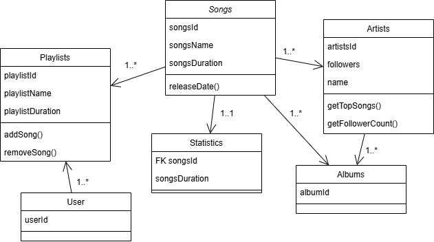
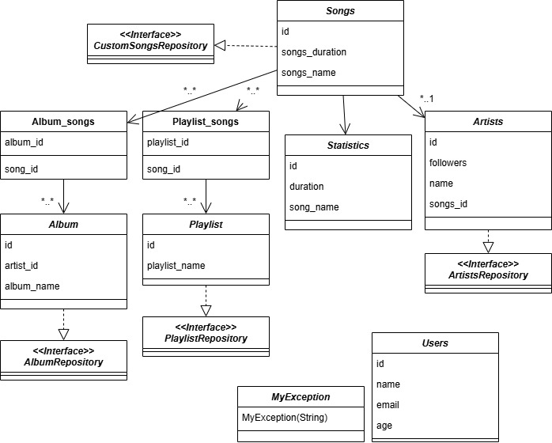
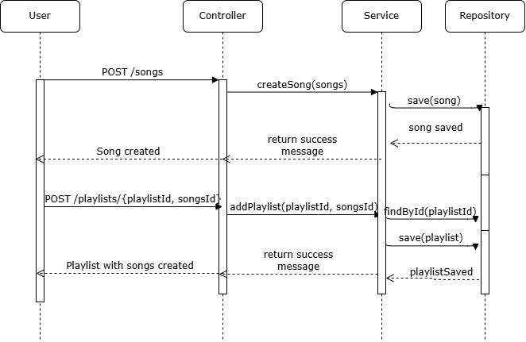

# m320

## Kompetenzen

- Kompetenzen are all located in the folder structure: <u>src/main/java/Kompetenzen</u>  

  
## Project

### Description
My Project is a song library. Then main functions are that the user can add songs and artists. That means that the application needs to have
all the create and delete functions.
The songs can be added to the playlists and removed too.  
As for artists, they have albums with songs.
The main idea is that the song that is being added and an artist that is newly added, both get assigned to each other &rarr; this is a bit harder to implement, which might not come to an end
during the project, because i would need an algorithm to assign songs to artists accordingly.  
There might be a function for showing statistics of the listened song's duration.

### Initial ClassDiagram


### Design Pattern
My application is based on a builder design pattern in java. It is based on that entities are being created with their properties and relationships.  
All entities are constructed and created on their own and no implementation is really done much, except when implementing the interfaces or exceptions.
As an example: creating entities like Songs, Artists, Playlist, Album and their relations make it a builder design pattern.

### End Class Diagram
Compared to my initial diagram, I have now join tables which I didn't have and also my custom repository as also all the 
repositories are defined on this class diagram. I have made an exception class which I didn't have on my initial class diagram.


### Sequence Diagram
Here is my sequence diagram of the user creating the songs and then adding them into a playlist:


### Set up
**Backend** of the project is in <u>/src/main/java/project.songsLibrary</u>  
The frontend of the project is located in <u>/src/main/project-frontend-songsLibrary</u>  
Class Diagramms are located in the backend project folder: <u>../project.songsLibrary/Diagrams</u>

- To start the **backend** do  
`mvn clean`  
`mvn spring-boot:run`
- To start the **frontend** do `yarn dev`

To create Database container:  
```shell
docker run --name projectM320 -e POSTGRES_PASSWORD=songs -e POSTGRES_USER=library -p 5432:5432 -d postgres:16
```
